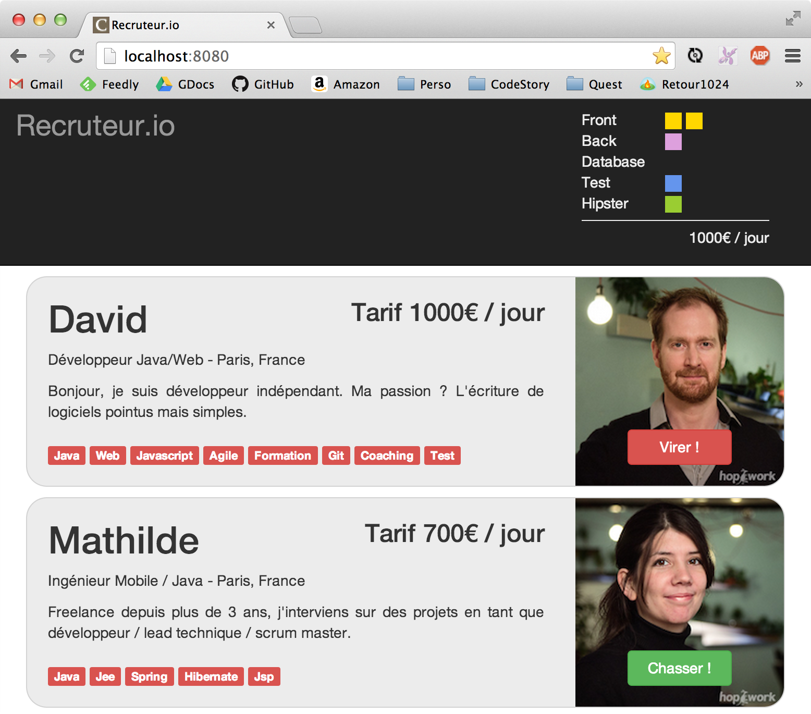

# Modern  java webapp

##  The CodeStory Way
by David Gageot & Jean-Laurent de Morlhon

## Abstract

Come participate to this Hand's on lab of 3 hours. Our target is clear: Teach you to program a modern webapp in Java (yes Java!), quickly, pragmatically and with ease.

With the help and live code demos of David Gageot & Jean-Laurent de Morlhon.

On the menu: Java 8, some AngularJs, a taste of CoffeeScript, Pair Programming, UI tests, hotkeys you didn't knew existed, plugins from outer space and an ultra fast development cycle. Yes we're still talking about java.

Monday, at work, you won't see your java project the same way.

# Install party

To attend in the best condition possible this workshop
  * A laptop with enough power for 3 hours
  * a fellow teammate
  * some software :
    * Java 8
    * maven 3.1
    * an IDE
    * a few graphical assets you'll find in this repo or on a usbstick, network drive we will share during the session


# Recruteur.io

You friend Jean-Claude from a famouse seconde-zone commerce school in the countryside has a tremendous business idea :

We're going to make a website to find programmers, and make a ton of money placing them in businesses accross the world to help write web projects.

Jean-Claude has heard that we probably need different skill set to build a great team. You need to mix this skills.

In 2014, Jean-Claude has decided you need 4 differents skill: `Front`, `Back`, `Database`, `Test`. And to sounds more appealing and also because it sells well, he added a fifth skill named `Hipster`.

The website could look like this :



Martine from HR has already bought the domain name on godady, you're free to go.
We have installed FrontPage and IIS on your laptop, you got 2 hours !

# Let's write some code

## Server startup

1. Create a blank directory, in which you add a pom.xml which could look like  :

```xml
<project xmlns="http://maven.apache.org/POM/4.0.0" xmlns:xsi="http://www.w3.org/2001/XMLSchema-instance"
         xsi:schemaLocation="http://maven.apache.org/POM/4.0.0 http://maven.apache.org/maven-v4_0_0.xsd">
  <modelVersion>4.0.0</modelVersion>

  <groupId>net.code-story</groupId>
  <artifactId>recruteurio</artifactId>
  <version>1.0-SNAPSHOT</version>

  <properties>
    <maven.compiler.source>1.8</maven.compiler.source>
    <maven.compiler.target>1.8</maven.compiler.target>
    <project.build.sourceEncoding>UTF-8</project.build.sourceEncoding>
  </properties>

  <dependencies>
    <dependency>
      <groupId>net.code-story</groupId>
      <artifactId>http</artifactId>
      <version>2.20</version>
    </dependency>
  </dependencies>
</project>
```

1. Then you create, like a grownup, the sources & tests directory (yeah, I know so modern, we got tests too..).

```bash
mkdir -p src/{main,test}/java
```
(btw you can create them with your mouse, but it's less hype and stylish, modern remember?)

1. We are here to make a webapp. But we are going to be classical for a change and start with a good old 'Hello World'

  You should create a `index.html` at the root of an `app` directory beside your `pom.xml` like this :

```bash
mkdir app
touch app/index.html
```
then you edit your `index.html` and you type in :

```html
---
layout: default
title: Hello Devoxx
---

<h1>Hello Devoxx</h1>

<p>I can serve a web page in a java app in less than 2 minutes... yes, I can!</p>
```

Before you ask the header in between dashes is called Yaml Front Matter. You can enter a bunch of information using Yaml syntax there. We won't go into the details there, but it's quite convenient.

In fluent-http, everything you put in the `app` directory is serve at the root of you webapp.
If you but some html, it will be serve, as-is, like js files, images etc...
If you but some Less files, they will be compiled to css and serve (with a cache don't worry), the same applied to Coffeescript to javascript, markdown to html and a few others.

1. Ok it's a java workshop or what ? When will I write some Java Code ! :

  In `src/main/java` you create a `Server` class. Like this one :

```java
import net.codestory.http.*;

public class Server {
  public static void main(String[] args) {
    new WebServer().start();
  }
}
```


1. Then you execute the `Server` class et open up a browser and aim it towards http://localhost:8080
If everything goes to plan, just about now, you'll feel less inclined to use weblo or tomcat, monday at work.

( if you're on the fancy side of stuff, and that you change your working dir, I know crazy but some of you do it, you'll have to point your working dir to the root of your app.It's usually done in the working dir input field in the run class dialog of your IDE )

## Server Side Mustaches with Handlebars

 1. We have some kind of server side templating (logic less) Tu peux utiliser le templating coté serveur

change your server to the following, we add a route to '/' which setup a conference variable with a random value.

```java
public class Server {
  public static void main(String[] args) {
    new WebServer(routes -> routes.get("/", () -> Model.of("conference", "Devoxx"))).start();
  }
}
```

Change your index.html to :
```Html
---
layout: default
title: hello mix-it
---

<h1>Hello [[conference]] !</h1>
```

Everything is rendered server side, consider it the jsp of 2014.

The templating language used here is [Handlebars](http://handlebarsjs.com/). You can use every handlebar instructions but within `[[` and `]]`.

### Loop

```java
public class Server {
  public static void main(String[] args) {
    new WebServer(routes -> routes.get("/", () -> Model.of("developers", Arrays.asList("David", "Jean-Laurent")))).start();
  }
}
```

Display the loop content like this:

```
[[#each developers]]
  [[.]]
[[/each]]
```

###  You can use Java Beans, Pojo, java object you name it.

```java
public class Developer {
  String name;
  int price;

  public Developer(String name, int price) {
    this.name = name;
    this.price = price;
  }
}

public class Server {
  public static void main(String[] args) {
    new WebServer(routes -> routes.get("/", () -> Model.of("developers", Arrays.asList(new Developer("David", 1000), new Developer("Jean-Laurent", 1000))))).start();
  }
}
```

Then you can display the inner property of each developer.

```
[[#each developers]]
  [[name]] [[price]]
[[/each]]
```

You can do much more things in Handlebars, but keep in mind it's call logic less for a reason, you can see more at :  http://handlebarsjs.com/.

### Test

We are going to extract a Configuration object to make it usable for tests.
Like this:

```java
public class Server {
  public static void main(String[] args) {
    new WebServer(new ServerConfiguration()).start();
  }

  public static class ServerConfiguration implements Configuration {
    @Override
    public void configure(Routes routes) {
      routes.get("/", () -> Model.of("developers", Arrays.asList(new Developer("David", 1000), new Developer("Jean-Laurent", 1000))));
    }
  }
}
```

Then we are going to write a end to end test, also called sometimes acceptance test, UI test or test-which-brake-too-often-but-are-really-really-life-saver.

So take an hour, setup selenium, install all drivers. Just kidding !
We do everything for you, with our hand cooked selenium wrapper called SimpleLenium

```xml
<dependency>
  <groupId>net.code-story</groupId>
  <artifactId>simplelenium</artifactId>
  <version>1.25</version>
  <scope>test</scope>
</dependency>
```

```java
import net.codestory.http.WebServer;
import net.codestory.simplelenium.SeleniumTest;
import org.junit.Test;

import static net.codestory.Server.ServerConfiguration;

public class BasketSeleniumTest extends SeleniumTest {
  WebServer webServer = new WebServer(new ServerConfiguration()).startOnRandomPort();

  @Override
  public String getDefaultBaseUrl() {
    return "http://localhost:" + webServer.port();
  }

  @Test
  public void list_developers() {
    goTo("/");

    find(".developer").should().haveSize(2);
    find(".developer").should().contain("David", "Jean-Laurent");
  }
}
```

Don't need to install Chrome, Selenium, PhantomJS or what. It just works.

To avoid port conflict (two server asking for the same port) with test running in parallel, fluent-http has a `startOnRandomPort` method which makes sure to aboid bind conflict.

## Simple REST Service

Everytime Fluent-http see a java bean or pojo in a service method signature it expose it in 'json' by default. It's build from the ground up to be a web container.

For instance if you want to return a Basket object, it could be defined like this :

```java
public class Basket {
  long front;
  long back;
  long database;
  long test;
  long hipster;
  long sum;
}
```
You can easily add a resource to you http server like this :

```java
public class BasketResource {
  @Get("/basket")
  public Basket basket() {
    return new Basket();
  }
}
```

Then you add it to your routes

```Java
public class ServerConfiguration implements Configuration {
    @Override
    public void configure(Routes routes) {
      routes.add(BasketResource.class);
    }
}
```

And when you call http://localhost:8080/basket You get :


```json
{
  "front":0,
  "back":0,
  ...
  "sum":0,
}
```

Now that we created our first resource, let's extract another resource for the index page.

```java
import net.codestory.http.annotations.Get;
import net.codestory.http.templating.Model;

public class IndexResource {
  @Get("/")
  public Model index() {
     return Model.of("developers", Arrays.asList(new Developer("David", 1000), new Developer("Jean-Laurent", 1000)));
  }
}
```

And plug it this way:

```java
public class ServerConfiguration implements Configuration {
    @Override
    public void configure(Routes routes) {
      routes
        .add(IndexResource.class)
        .add(BasketResource.class);
    }
}
```

## Integration testing with RestAssured

Integration tests at the resource level are intresting because it's the only way to check that our domain code is properly wrapped into a REST resource.
You should concentrate on testing on http input/output. while mocking the domain code.

We use the RestAssured library which offer a fluent API to write tests. Testing the http interaction layer is quite tedious to write.


Add to your pom the dependency :
```xml
    <dependency>
      <groupId>com.jayway.restassured</groupId>
      <artifactId>rest-assured</artifactId>
      <version>2.3.4</version>
      <scope>test</scope>
    </dependency>
```

RestAssured needs a real http server. This is usually done in the integration testing phase through the failsafe maven plugin. But we are crazy modern guys, we don't want to have distinguish those tests since we are able to execute integration test at almost the same speed as unit tests.
To be able to have integration test execute as fast as unit test, you need a lighting fast webserver, that's why we use fluent-http. It's very good at it.
Less configuration, lighting speed, you saved at least many hours in your project...

Here's a typical skeleton for a REST test.
```java
public class BasketRestTest {
  WebServer webServer = new WebServer(new ServerConfiguration()).startOnRandomPort();

  @Test
  public void query_basket() {
    given().port(webServer.port())
      .when().get("/basket")
      .then().contentType("application/json").statusCode(200);
  }
}

## Angular

To add angularjs the java-way you can use webjars, webjars are a collection of javascript library emebeded in jar properly registered in a maven repository.( don''t tell about this the javascript guys they could have a heart attack)

```xml
    <dependency>
      <groupId>org.webjars</groupId>
      <artifactId>angularjs</artifactId>
      <version>1.3.0</version>
    </dependency>
```
You'll use the `/webjars/angularjs/1.3.0/angular.min.js` path in `<script>` tag.
You can do the same thing, with all your front-end dependencies: javascript library, css library, fonts, icons etc...

If you thing embedding a javascript library in a zip file, renamed a .jar is kind of completly mad, you can use [bower](http://bower.io/). It's a bit more hype, but you have to move the file by hand from the bower directory to your `app` directory.

### Use coffeescript

You can write your angular controller in coffeescript using a class syntax. This enable to properly and easly isolate the scope variables.
For instance :

```coffee
angular.module 'devoxx', []

.controller 'BasketController', class
    constructor: (@$http) ->
      @info = "Hello World"
      @basket = {}

    search: ->
      @$http.get("/basket").success (data) =>
        @basket = data
```

To make it work you can add the ng-app tag by hand, or put it in the YAML front matter.
don't forget to add the angular lib script tag.
```yaml
---
title: Hello Devoxx
ng-app: devoxx
---
<div ng-controller="BasketController as controller">
  {{controller.info}}
  <a href="" ng-click="controller.search()">search</a>
</div>

<script src="/webjars/angularjs/1.3.0/angular.min.js"></script>
```

# Unit, integration, javascript & ui Testing !

## Resource Unit Testing with JUnit

Nothing, *that* modern in here.

We use the usual suspects of the industry here, assertj (fluent assertions) & mockito (mocking).

You can add those two libraries like this in your pom :

```xml
    <dependency>
      <groupId>org.assertj</groupId>
      <artifactId>assertj-core</artifactId>
      <version>1.7.0</version>
      <scope>test</scope>
    </dependency>

    <dependency>
      <groupId>org.mockito</groupId>
      <artifactId>mockito-all</artifactId>
      <version>1.10.8</version>
      <scope>test</scope>
    </dependency>
```

Let's try starting to write the resources we would need to do our app for Jean-Claude.

We need some kind of developer domain object :

```java
public class Developer {
  public String prenom;
  public String job;
  public String ville;
  public String photo;
  public String description;
  public String email;
  public String[] tags;
  public int price;
}
```

We need some kind of developers list :
```json
[
  {
    "email": "david@devoxx.io",
    "prenom": "David",
    "job": "Java/Web Developer",
    "ville": "Paris, France",
    "description": "Bonjour, je suis développeur indépendant. Ma passion ? L'écriture de logiciels pointus mais simples.",
    "tags": [
      "Java", "Web", "Javascript", "Agile", "Formation", "Git", "Coaching", "Test"
    ],
    "photo": "david",
    "price": 1000
  },
  {
    "email": "jeanlaurent@devoxx.io",
    "prenom": "Jean-Laurent",
    "job": "Programmer",
    "ville": "Houilles, France",
    "description": "WILL WRITE CODE FOR FOOD",
    "tags": [
      "Java", "Test", "CoffeeScript", "Node", "Javascript"
    ],
    "photo": "jl",
    "price": 1000
  }
]
```

So let's write our own version of an "Oracle Database" :
```java
public class Developers {
  public Developer find(String email) {
    return Stream.of(findAll()).filter(dev -> email.equals(dev.email)).findFirst().orElse(null);
  }

  Developer[] findAll() {
    try {
      return new ObjectMapper().readValue(Resources.getResource("developers.json"), Developer[].class);
    } catch (IOException e) {
      throw new RuntimeException("Unable to load developers list", e);
    }
  }
}
```

Here's a corresponding tests :
Yes it's a test based on data, no it's not perfect, yes it's a good exapple of unit testing.

```java
import org.junit.Test;

import static org.assertj.core.api.Assertions.assertThat;

public class DevelopersTest {
  @Test
  public void load_developers() {
    Developer[] developers = new Developers().findAll();

    assertThat(developers).hasSize(2);
  }
}
```

## Unit testing angular controller with Karma

We can unit test angular controller.

We are going to put a little step in the javascript world, using Karma & Jasmine.

You need to have the angular files available in the path.
If you use the webjars, it's a good time to type in a `bower install` in your console.

Use the karma configuration file you'll find in the usb stick.
If you don't use Chrome on your laptop, you can open a configuration file and replace `chrome` by`safari`, `firefox`... or `ie` !

Testing are launched using `karma start karma.conf.coffee`
(If karma is not in the path, you can find them in `node_modules/karma/bin/karma`)

```coffee
should = chai.should()

describe 'Basket tests', ->
  beforeEach ->
    module 'devoxx'
    inject ($controller) ->
      @controller = $controller 'BasketController'

  it 'should start with an empty basket', ->
    @controller.emails.should.eql []
    @controller.basket.should.eql {}
```

maven frontend plugin


```json
{
    "name": "devoxx-codestory-lab",
    "version": "1.0.0",
    "description": "Node dependencies for devoxx-codestory-lab",
    "main": "index.js",
    "author": "Jean-Laurent de Morlhon && David Gageot",
    "license": "MIT",
    "devDependencies": {
        "chai": "^1.9.1",
        "coffee-script": "^1.7.1",
        "karma": "^0.12.16",
        "karma-coffee-preprocessor": "^0.2.1",
        "karma-jasmine": "^0.2.2",
        "karma-jsmockito-jshamcrest": "0.0.6",
        "karma-phantomjs-launcher": "^0.1.4",
        "jsmockito": "^1.0.5",
        "mocha": "^1.20.1",
        "protractor": "^0.20.1"
    },
    "scripts": {
        "test": "node_modules/mocha/bin/mocha --reporter dot google-scripts/*-test.js"
    },
    "repository": {
        "type": "git",
        "url": "git://github.com/CodeStory/devoxx-quickstart.git"
    }
}
```

```xml
<profiles>
<profile>
  <id>karma</id>
  <activation>
    <property>
      <name>!skipTests</name>
    </property>
  </activation>
  <build>
    <plugins>
      <plugin>
        <groupId>org.codehaus.mojo</groupId>
        <artifactId>exec-maven-plugin</artifactId>
        <version>1.3.2</version>
        <executions>
          <execution>
            <id>extract webjars</id>
            <goals>
              <goal>java</goal>
            </goals>
            <phase>generate-test-resources</phase>
          </execution>
        </executions>
        <configuration>
          <mainClass>misc.ExtractWebjars</mainClass>
        </configuration>
      </plugin>
      <plugin>
        <groupId>com.github.eirslett</groupId>
        <artifactId>frontend-maven-plugin</artifactId>
        <version>0.0.16</version>
        <configuration>
          <workingDirectory>${project.basedir}</workingDirectory>
        </configuration>
        <executions>
          <execution>
            <id>install node and npm</id>
            <goals>
              <goal>install-node-and-npm</goal>
            </goals>
            <phase>generate-test-resources</phase>
            <configuration>
              <nodeVersion>v0.10.29</nodeVersion>
              <npmVersion>1.4.16</npmVersion>
            </configuration>
          </execution>
          <execution>
            <id>npm install</id>
            <goals>
              <goal>npm</goal>
            </goals>
            <phase>generate-test-resources</phase>
            <configuration>
              <arguments>install</arguments>
            </configuration>
          </execution>
          <execution>
            <id>karma tests</id>
            <goals>
              <goal>karma</goal>
            </goals>
            <phase>test</phase>
            <configuration>
              <karmaConfPath>${project.basedir}/src/test/karma.conf.ci.js</karmaConfPath>
            </configuration>
          </execution>
        </executions>
      </plugin>
    </plugins>
  </build>
</profile>
</profiles>
```

### Service http

```coffee
should = chai.should()

describe 'Basket tests', ->
  beforeEach ->
    module 'devoxx'
    inject ($controller, $httpBackend) ->
      @controller = $controller 'BasketController'
      @http = $httpBackend

  it 'should refresh basket after adding a developer', ->
    @http.expectGET('/basket?emails=foo@bar.com').respond '{"test":0,"back":0,"database":0,"front":0,"hipster":0,"sum":0}'
    @controller.add 'foo@bar.com'
    @http.flush()

    @controller.emails.should.eql ['foo@bar.com']
    @controller.basket.should.eql
      test: 0
      back: 0
      database: 0
      front: 0
      hipster: 0
      sum: 0
```

## Add bootstrap

To add bootstrap you can use webjars. You add to your pom :

```xml
<dependency>
  <groupId>org.webjars</groupId>
  <artifactId>bootstrap</artifactId>
  <version>3.3.0</version>
</dependency>
```

If you use the YAML Front Matter you can easly add in the header :

```YAML
---
title: recruteur.io
styles: ['/webjars/bootstrap/3.1.1/css/bootstrap.css']
---
```

-- David & Jean-Laurent
