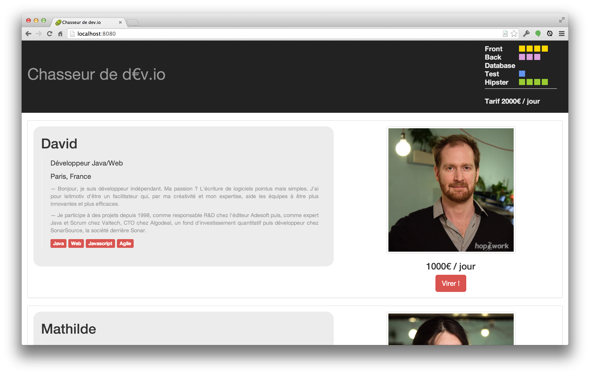

# Application Web Moderne en Java
## The CodeStory Way
by David Gageot & Jean-Laurent de Morlhon

Devoxx Hand's on Labs

Louis Armstrong CD

13:30 - 16:30

## Abstract
Venez participer à un Hand's On Lab de 3 heures. L'objectif est simple : apprendre à développer une application web moderne en Java. Rapidement, de manière pragmatique et en toute confiance.

Avec l'assistance et les démos live de David Gageot et Jean-Laurent de Morlhon.

Au menu : du Java 8, un poil d'Angular, un soupçon de CoffeeScript, du MongoDB, du pair-programming, des tests IHM, des hotkeys de malade, des plugins de fou et un cycle de développement ultra rapide. Oui vous ne rêvez pas on parle bien de Java.

Lundi, au boulot, vous ne verrez plus votre projet java de la même manière.


# Install party

Pour faire cet atelier, tu as besoin  :
  * d'un portable avec de la batterie pour durer 3h de coding
  * d'un binome
  * de logiciels :
    * Java 8
    * maven 3.1
    * node.js 0.10+
    * un repo maven "chauffé"
    * d'un IDE
    * de quelques "assets" de données et graphiques

Tu trouveras tout ça dans une clé USB que nous te distribuons au début de la session.

# Recruteur.io

Votre ami Jean-Claude de SupDeCo Aurillac a une idée de business de malade, Mark Zuckerberg en tremble encore : il s'agit de faire un site pour trouver des grouillots modernes (programmeurs) pour se faire une tonne de $$$ en les plaçant dans des structures qui font des projets web.

Le truc c'est que visiblement les programmeurs ils ont des talents differents et que pour faire une bonne équipe, il faut mixer ces talents.
Entre recherche de mots clé (ex: cherche stagiaire, 7 ans d'experience en j2ee, vba et golo est un plus) ce que tous les sites font, il faut plutot être sur qu'ils soient bons dans un certains nombre de caracteristiques utiles aux projets d'aujourd'hui.

En 2013, il nous faut donc 4 talents et essayer de maximiser cela : `Front`, `Back`, `Database`, `Test` et pour faire chouette et parce que c'est plus vendeur `Hipster`.
Donc le site doit optimiser le prix (le nerf de la guerre d'aprés Jean-Claude, et il sait de quoi il parle: il a une bm) mais aussi ces 4 caractéristiques.

Ca pourrait ressembler à ça :



Martine de la compta, a déjà acheté le nom de domaine, y'a plus qu'a.
On t'a installé Frontpage et IIS, let's go ! T'as 2h.

# Let's write some code

## Démarrer le serveur

1. Creer toi un repertoire tout neuf, dans lequel tu poserais un pom qui pourrait ressembler à ça dedans :

  ```xml
  <project xmlns="http://maven.apache.org/POM/4.0.0" xmlns:xsi="http://www.w3.org/2001/XMLSchema-instance"
           xsi:schemaLocation="http://maven.apache.org/POM/4.0.0 http://maven.apache.org/maven-v4_0_0.xsd">
    <modelVersion>4.0.0</modelVersion>

    <groupId>net.devoxx</groupId>
    <artifactId>chasseurdedevio</artifactId>
    <version>1.0-SNAPSHOT</version>

    <properties>
      <maven.compiler.source>1.8</maven.compiler.source>
      <maven.compiler.target>1.8</maven.compiler.target>
      <project.build.sourceEncoding>UTF-8</project.build.sourceEncoding>
    </properties>

    <dependencies>
      <dependency>
        <groupId>net.code-story</groupId>
        <artifactId>http</artifactId>
        <version>1.42</version>
      </dependency>
      <dependency>
        <groupId>junit</groupId>
        <artifactId>junit</artifactId>
        <version>4.11</version>
        <scope>test</scope>
      </dependency>
    </dependencies>

  </project>
  ```

1. Ensuite tu te cree comme un grand les repertoires de sources et de tests qui vont bien.
(tu peux aussi utiliser ta souris, mais ca fait moins hype)

  ```bash
  mkdir -p src/{main,test}/java
  ```
1. On est là pour faire du web. Alors allons y pour un helloworld classique ( c'est bien le classique aussi parfois).
  Tu peux creer un fichier `index.md` à la racine d'une répertoire `app` a coté de ton `pom.xml`

  ```bash
  mkdir app
  touch index.md
  ```

  Ensuite tu édites `index.md`(md c'est pour markdown mais tu le sais déjà, sauf qu'on commence avec un peu de YAML au début, ça s'appelle du YAML Front Matter) et tu colles dedans ça par exemple:

  ```Markdown
  title:hello devoxx
  ---
  # Hello Devoxx

  Je sers une page web avec un projet java en moins de 2 minutes... si si c'est possible
  ```
  Dans fluent-http, tous ce qui est dans le repertoire app est servi par défaut à la racine de ton serveur.
  Si tu y mets du html il sera servi tel quel, comme pour le js, les images etc..
  Si tu mets du less, il sera compilé en css, du coffee en js, du markdown en html, etc...

1. Bon on code du java ou pas ? :

  Dans src/main/java qqpart tu creés une classe `Server` par exemple comme celle là:

  ```java
  package com.acme;

  import net.codestory.http.*;

  public class Server {

    public static void main(String[] args) {
      new WebServer().start();
    }
  }
  ```
1. Execute la classe Server et pointe ton navigateur sur http://localhost:8080
Normalement, là, tu as moins envie d'utiliser weblo et tomcat, lundi au boulot.


## Des moustaches coté serveur avec Handlebars
Le repertoire `_data` à la racine de ton projet (a coté de ton `pom.xml` donc), peut contenir des fichiers json ou yaml
qui sont directement accessible serverside.

1. Creer un fichier `hello.json` dans `_data`
qui pourrait contenir les choses suivantes :
```json
{"greetings":"Hello World"}
```
Tu peux ajouter dans une page html le code suivant:
```html
<h1>Exemple de fichier de données</h1>
[[greetings]]
```
sans redémarer ton serveur, le fichier sera servi et le processing sera fait coté serveur.

Le langage de template ici est du handlebars (http://handlebarsjs.com/) tu peux donc utiliser toutes les commandes handlebars comme par exemple:

### Boucle
Avec une liste de personne comme cela :
```json
{
  "people": [
    {"firstName": "Yehuda", "lastName": "Katz", "author":true},
    {"firstName": "Carl", "lastName": "Lerche","author":false},
    {"firstName": "Alan", "lastName": "Johnson","author":true}
  ]
}
```
tu peux les afficher avec une boucle comme ceci:
```
[[#each people]]
  [[firstName]] [[lastName]]
[[/each]]
```

### condition

```html
<div class="entry">
  [[#if author]]
  <h1>[[firstName]] [[lastName]]</h1>
  [[/if]]
</div>
```

Il ya d'autres éléments (mais guère plus, que tu peux voir dans http://handlebarsjs.com/)

### Ajouter bootstrap

Pour ajouter bootstrap tu peux utiliser les webjars

tu ajoutes à ton pom

```xml
    <dependency>
      <groupId>org.webjars</groupId>
      <artifactId>bootstrap</artifactId>
      <version>3.1.1</version>
    </dependency>
```
Tu peux acceder en utilisant le chemin `/webjars/bootstrap/3.1.1/css/bootstrap.css` dans une balise styles.
Si tu utilise le YAML Front Matter tu peux carrement le rajouter dans celui ci :
```YAML
---
title: Chasseur de dev.io
styles: /webjars/bootstrap/3.1.1/css/bootstrap.css
---
```
Tu peux agir de la même manière avec toutes tes dépendances front.

Sinon y'a bower c'est plus hype mais tu dois déplacer les fichiers à la main.

# Server Side Stuff don't suck

fluent-http expose en json vos beans par défaut.
Par exemple pour retourner une persone qui pourrait être défini comme suis :
```Java
public class Person {
  public String name;
  public int age

  public Person(String name, int age) {
    this.name = name;
    this.age = age;
  }
}
```

Vous pouvez facilement ajouter une resource à votre serveur http comme suis :
```Java
public class PersonResource {

  @Get("/douglas")
  public Person getPerson() {
    return new Person("Scott Adams",42);
  }
}
```
Vous le brancher dans vos routes :
```Java
package com.acme;

import net.codestory.http.*;

public class Server {

  public static void main(String[] args) {
    new WebServer(routes -> routes.add(PersonResource.class).start();
  }
}
```
Et en appellant http://localhost:8080/douglas vous obtenez :
```json
{
  "name":"Scott Adams",
  "age":42
}
```
# How I'm sure it works ?

## Tester unitairement ses resources avec JUnit

## Tester en intégration ses resources avec RestAssured

## Tester unitairement ses controlleurs Angular avec Karma

## Tester toute son application avec Protractor

# You want more ?
